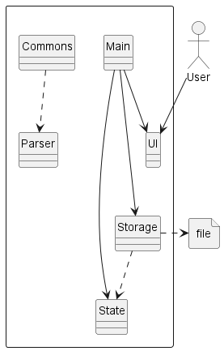
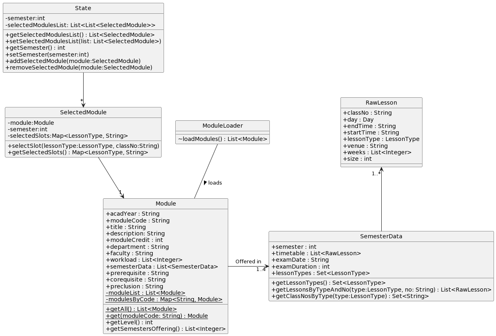
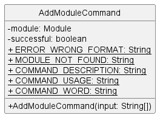
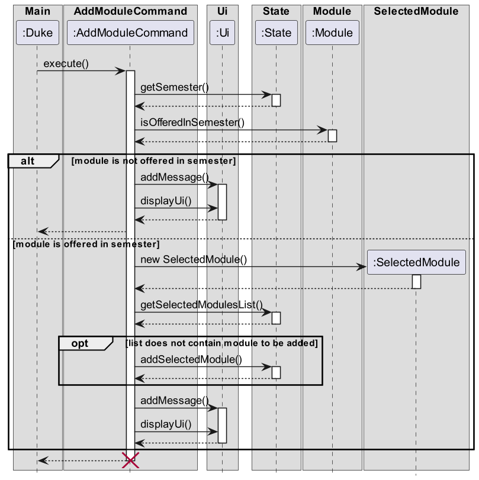
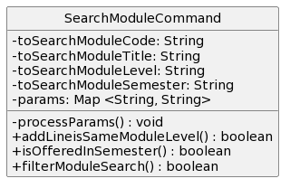
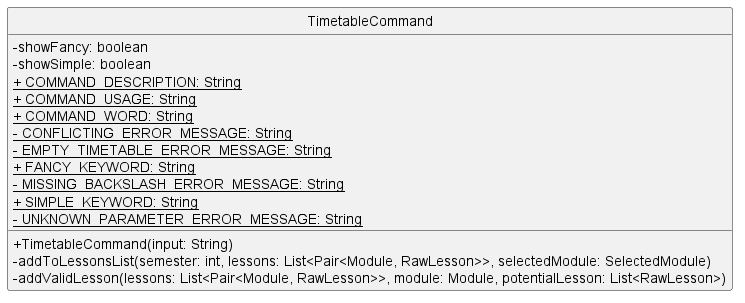
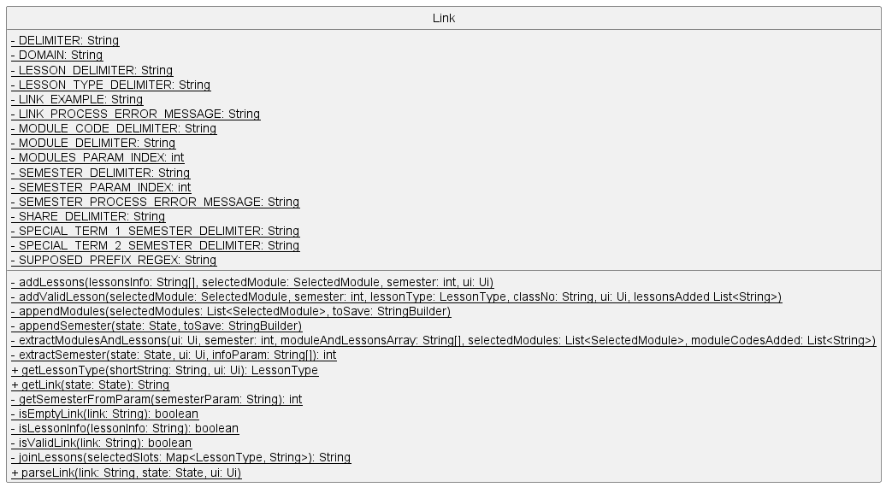
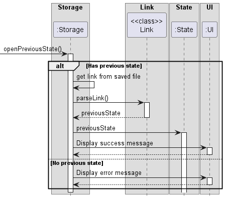

# Developer Guide for Yet Another Module Organiser / Manager

## Table Of Contents

- [Developer Guide for Yet Another Module Organiser / Manager](#developer-guide-for-yet-another-module-organiser--manager)
    - [Table Of Contents](#table-of-contents)
    - [1. Introduction](#1-introduction)
        - [1.1. Welcome!](#11-welcome)
    - [2. Setting up](#2-setting-up)
        - [2.1. Prerequisites](#21-prerequisites)
        - [2.2. Setting up the project locally](#22-setting-up-the-project-locally)
        - [2.3. Configure the coding style](#23-configure-the-coding-style)
    - [3. Design](#3-design)
        - [3.1 Architecture](#31-architecture)
        - [3.2 Model package](#32-model-package)
            - [3.2.1 Module Loader](#321-module-loader)
            - [3.2.2 Timetable](#322-timetable)
        - [3.3 Parser Component](#33-parser-component)
            - [3.3.1 How the feature is implemented](#331-how-the-feature-is-implemented)
            - [3.3.2 Why it is implemented this way](#332-why-it-is-implemented-this-way)
            - [3.3.3 Alternatives considered](#333-alternatives-considered)
        - [3.4 Command Component](#34-command-component)
            - [3.4.1 AddModuleCommand](#341-addmodulecommand)
                - [3.4.1.1 How the feature is implemented](#3411-how-the-feature-is-implemented)
                - [3.4.1.2 Why it is implemented this way](#3412-why-it-is-implemented-this-way)
                - [3.4.1.3 Alternatives considered](#3413-alternatives-considered)
            - [3.4.2 RemoveModuleCommand](#342-removemodulecommand)
                - [3.4.2.1 How the feature is implemented](#3421-how-the-feature-is-implemented)
                - [3.4.2.2 Why it is implemented this way](#3422-why-it-is-implemented-this-way)
                - [3.4.2.3 Alternatives considered](#3423-alternatives-considered)
            - [3.4.3 HelpCommand](#343-helpcommand)
                - [3.4.3.1 How the feature is implemented](#3431-how-the-feature-is-implemented)
                - [3.4.3.2 Why it is implemented this way](#3432-why-it-is-implemented-this-way)
                - [3.4.3.3 Alternatives considered](#3433-alternatives-considered)
            - [3.4.4 SearchModuleCommand](#344-searchmodulecommand)
                - [3.4.4.1 How the feature is implemented](#3441-how-the-feature-is-implemented)
                - [3.4.4.2 Why it is implemented this way](#3442-why-it-is-implemented-this-way)
                - [3.4.4.3 Alternatives considered](#3443-alternatives-considered)
            - [3.4.5 SelectSlotCommand](#345-selectslotcommand)
            - [3.4.6 SelectSemesterCommand](#346-selectsemestercommand)
            - [3.4.7 InfoCommand](#347-infocommand)
                - [3.4.7.1 How the feature is implemented](#3471-how-the-feature-is-implemented)
                - [3.4.7.2 Why it is implemented this way](#3472-why-it-is-implemented-this-way)
                - [3.4.7.3 Alternatives considered](#3473-alternatives-considered)
            - [3.4.8 TimetableCommand](#348-timetablecommand)
                - [3.4.8.1 How the feature is implemented](#3481-how-the-feature-is-implemented)
                - [3.4.8.2 Why it is implemented this way](#3482-why-it-is-implemented-this-way)
            - [3.4.9 ByeCommand](#349-byecommand)
            - [3.4.10 ListCommand](#3410-listcommand)
            - [3.4.11 ExportCommand](#3411-exportcommand)
            - [3.4.12 ImportCommand](#3412-importcommand)
        - [3.5 Utils Component](#35-utils-component)
            - [3.5.1 UI Component](#351-ui-component)
                - [3.5.1.1 Why it is implemented this way](#3511-why-it-is-implemented-this-way)
                - [3.5.1.2 Alternative Considered](#3512-alternative-considered)
            - [3.5.2 Link Component](#352-link-component)
                - [3.5.2.1 Why is it implemented this way](#3521-why-is-it-implemented-this-way)
                - [3.5.2.2 Alternative Considered](#3522-alternative-considered)
            - [3.5.3 Storage Component](#353-storage-component)
                - [3.5.3.1 How the feature is implemented](#3531-how-the-feature-is-implemented)
                - [3.5.3.2 Why it is implemented this way](#3532-why-it-is-implemented-this-way)
                - [3.5.3.3 Alternatives considered](#3533-alternatives-considered)
    - [4. Documentation](#4-documentation)
    - [5. Testing](#5-testing)
        - [5.1. Running tests](#51-running-tests)
        - [5.2 Instructions for manual testing](#52-instructions-for-manual-testing)
    - [Target user profile](#target-user-profile)
    - [Value proposition](#value-proposition)
    - [Appendix A: Product scope](#appendix-a-product-scope)
    - [Appendix B: User Stories](#appendix-b-user-stories)
    - [Appendix C: Non-Functional Requirements](#appendix-c-non-functional-requirements)
    - [Appendix D: Glossary](#appendix-d-glossary)
    - [Appendix E: Acknowledgements](#appendix-e-acknowledgements)
        - [Third-party libraries](#third-party-libraries)

## 1. Introduction

### 1.1. Welcome!

Welcome, and thank you for choosing to help contribute to Yet Another Module Organiser/ Manager!
Yet Another Module Organiser and Manager (YAMOM) is an all-in-one desktop app featuring
a full course catalogue, module search and timetable builder for the National University of Singapore, optimized for use
via a Command Line Interface.

This document intends to onboard developers onto YAMOM. We hope to bring you in to fix bugs, or even adding
new features and dimensions to YAMOM!
It gives insights on how the project is set up, the architecture used,
and the code style one should adopt when contributing to the project.

## 2. Setting up

This section describes the development tools used in the creation of YAMOM.

### 2.1. Prerequisites

1. **JDK** 11
2. **IntelliJ** IDEA
3. **Gradle** 6.2

### 2.2. Setting up the project locally

1. **Fork** this repo, and **clone** the fork into your computer.
2. Open IntelliJ (if you are not in the welcome screen, click **`File`** > **`Close Project`** to close the existing
   project dialog first).
3. Set up the correct JDK version for Gradle  
   a. To set up the correct project structure **`Configure`** > **`Project Defaults`** > **`Project Structure`**  
   b. Under **`New...`** find the directory of the appropriate JDK version.
4. Click **`Import Project`**.
5. Find the **`build.gradle`** file and select it. Click **`OK`**.
6. Click **`Open as Project`**.
7. Click **`OK`** and accept the default settings.

### 2.3. Configure the coding style

In IntelliJ's IDEA we
adopt [[se-edu/guides] IDEA: Configuring the code style](https://se-education.org/guides/tutorials/intellijCodeStyle.html)
to set up IDEA’s coding style to match ours.

> Optionally, you can follow the
> guide [[se-edu/guides] Using Checkstyle](https://se-education.org/guides/tutorials/checkstyle.html)
> to find how to use the CheckStyle within IDEA e.g., to report problems as you write code.

## 3. Design

<!-- {Describe the design and implementation of the product. Use UML diagrams and short code snippets where applicable.} -->

### 3.1 Architecture

  
**How the architecture components interact with each other**

Core program flow (`Main`) is managed by the Duke class.

`Commons` represents a collection of commonly used classes.


The Duke class delegates work to the Ui class to handle user input.

User input is passed to the Parser class to parse the input as a command. Each command subclass handles its own
execution.

These are the three main subcomponents that duke and command subclasses delegate work to:

- `Ui`: Handles user interactions such as receiving input and displaying output.
- `State`: Stores and updates application state.
- `Storage`: Reads and writes data to the hard disk in a NUSMods export link format.

### 3.2 Model package

The Model package is responsible for business logic - in particular, for dealing with any module related data. The
design of these classes is based off the
original [NUSMods type classes](https://github.com/nusmodifications/nusmods/blob/master/scrapers/nus-v2/src/types/modules.ts)
.

It consists of the following classes:

- `Day`: Represents a day in the timetable.
- `LessonType`: Represents the type of lesson.
- `Module`: Represents a module in NUS.
- `ModuleLoader`: Loads the module information from the NUSMods resource file.
- `RawLesson`: Represents a single block in a timetable representing one lesson slot. Properties are meant to be
  freely accessed but not modified.
- `SelectedModule`: Represents a module selected by the user that is to be added into his or her timetable.
- `SemesterData`: Semester data contains all the module information pertaining to a single semester.
- `Timetable`: Creates a timetable for the user with their selected modules and in their planning semester.



#### 3.2.1 Module Loader

Module loading is handled by the `ModuleLoader` class. This class contains logic to parse the data file stored
at `src/main/resources/moduleFull.zip`. The data file is a ZIP file containing a JSON file. Zipping is used to minimize
the application size. In exchange, the data file needs to be unzipped to read the module data, but this only happens
once at the start of the application. JSON parsing in the `ModuleLoader` class is done using
the [Jackson Databind library](https://mvnrepository.com/artifact/com.fasterxml.jackson.core/jackson-databind).

#### 3.2.2 Timetable

The `Timetable` class handles the logic of formatting a timetable, given a set of lessons to be shown. To cater to a CLI
environment, the timetable is always shown with time running vertically. One of the challenges in timetable formatting
is that lessons may overlap, and the width of the timetable needs to be adjusted in such cases.

The sequence of steps to generate a timetable can be summarised as follows:

1. Calculate the earliest and latest class. This will determine the height of the timetable.
2. Check if any classes have overlapping timeslots. If so, generate a list of indentation levels for the classes.
3. Create a buffer, a 2D array of Strings, to store our output.
4. Write the day labels and time labels to the buffer.
5. For each class, draw the bounding box into the buffer and write the class codes into the buffer.

### 3.3 Parser Component


The <code>Parser</code> component can:

- return the correct command type based on user input.

This component also consists of `DayParser` and `LessonTypeParser` to help parse their respective
day and lesson info into programme-understood values.

#### 3.3.1 How the feature is implemented

The main function of the `Parser` component is `parse` which returns the correct command type
based on the first word of the user input. It also consists of various helper functions for the different
`Command` classes to validate if the user input is correct.

#### 3.3.2 Why it is implemented this way

The `Parser` component should not know what is a valid command for the specific command type but instead
can assist in parsing the user input to do data validation. It only carries out basic data validation to
check if the user input does not belong to any command type. This also makes it easier to add new commands
in the future as the developer only needs to create a new command class and the parser checks for the new keyword.

#### 3.3.3 Alternatives considered

All invalid inputs handled by the `Parser` and only returns valid `Command` classes.
However, this will make the `Parser` class will be very long as it has to check for all invalid inputs for all commands.
Additionally, it will be difficult to implement as different commands have different parameters that they require.
Finally, it will also lead to tight coupling and decreased cohesion.

### 3.4 Command Component


The <code>Command</code> component can:

- execute based on the command type.

The individual `Command` classes contains `public static final String` that specifies the keyword, usage and description
of that command.
They may also consist of various possible error messages related to that command.

Below is a table of command subclasses and their respective command type. The different command types extends from the
Command class and are all in the command package. You may click the specific command under **Command Subclass** to view
more information about that command.

| Command Word | Command Subclass                                      | Intended Outcome                                                   |
|--------------|-------------------------------------------------------|--------------------------------------------------------------------|
| `add`        | [`AddModuleCommand`](#341-addmodulecommand)           | Adds the user input module into their timetable.                   |
| `remove`     | [`RemoveModuleCommand`](#342-removemodulecommand)     | Removes the user input module from their timetable.                |
| `list`       | [`ListCommand`](#3410-listcommand)                    | Display all the module and slot selected by user                   |
| `bye`        | [`ByeCommand`](#349-byecommand)                       | Exits the program.                                                 |
| `export`     | [`ExportCommand`](#3411-exportcommand)                | Creates a portable NUSMod link to create their timetable on NUSMod |
| `info`       | [`InfoCommand`](#347-infocommand)                     | Display all details about a module.                                |
| `help`       | [`HelpCommand`](#343-helpcommand)                     | Display all possible command words and their usage to user.        |
| `import`     | [`ImportCommand`](#3412-importcommand)                | Import user's timetable from a NUSMod share timetable link.        |
| `search`     | [`SearchModuleCommand`](#344-searchmodulecommand)     | Searches similar modules based on code, title, semester or level.  |
| `semester`   | [`SelectSemesterCommand`](#346-selectsemestercommand) | Selects the semester that the user want.                           |
| `select`     | [`SelectSlotCommand`](#345-selectslotcommand)         | Selects the time slot for the different lesson types.              |
| `timetable`  | [`TimetableCommand`](#348-timetablecommand)           | Views the user timetable with user's selected modules.             |

#### 3.4.1 AddModuleCommand

The <code>AddModuleCommand</code> class extends from the <code>Command</code> class and adds the user input module into
their timetable.



##### 3.4.1.1 How the feature is implemented

The `AddModuleCommand` class extends the `Command` class.
The constructor `AddModuleCommand()` parses the user `input` module code `.toUpperCase()` as the format to fetch an
instance of `module` from its class. Boolean `successful` field is used to flag successfully added modules in comparison
to instances where it is not possible to add the `module` as it already exists in the `state`'s `selectedModuleList`.
It overrides the `execute()` method from the `Command` class, and updates `successful` accordingly, which will later be
passed on to the overridden `getExecutionMessage()` which displays the result of data validation that
new `selectedModule`
added are unique.

##### 3.4.1.2 Why it is implemented this way

In order to be able to be able to compare the new instance of `selectedModule` created of the module code the user wants
to delete,
in the constructor against an instance of the module the user has previously added into the `selectedModuleList`,
the `equals()`
method extended from super class `Object` has been overridden to return `true` for instances where `semester`
and `module`
(specifically `moduleCode` attribute from the parent class) are the same, allowing us to validate and add the desired
module.

The following sequence diagram shows how the operation works:



##### 3.4.1.3 Alternatives considered

Initially, data validation was being handled by the `Parser` class, however in the principles of avoiding tight coupling
and improving cohesion, it was moved back under the `AddModuleCommand` class.

#### 3.4.2 RemoveModuleCommand

The <code>RemoveModuleCommand</code> class extends from the <code>Command</code> class and deletes the user input module
from their timetable.

##### 3.4.2.1 How the feature is implemented

The `RemoveModuleCommand` class extends the `Command` class.
Similar to `AddModuleCommand` class, the constructor `RemoveModuleCommand()` parses the user `input` module
code `.toUpperCase()` as the format to fetch an
instance of `module` from its class. Boolean `successful` field is used to flag successfully added modules in comparison
to instances where it is not possible to add the `module` as it already exists in the `state`'s `selectedModuleList`.
It overrides the `execute()` method from the `Command` class, and updates `successful` accordingly, which will later be
passed on to the overridden `getExecutionMessage()` which displays the result of data validation that
the `selectedModule`
instance is only removed from the `selectedModuleList` if it exists.

##### 3.4.2.2 Why it is implemented this way

In order to be able to be able to compare the new instance of `selectedModule` created of the module code the user wants
to delete,
in the constructor against an instance of the module the user has previously added into the `selectedModuleList`,
the `equals()`
method extended from super class `Object` has been overridden to return `true` for instances where `semester`
and `module`
(specifically `moduleCode` attribute from the parent class) are the same, allowing us to validate and remove the desired
module.

##### 3.4.2.3 Alternatives considered

Once again, data validation was being handled by the `Parser` class, however in the principles of avoiding tight
coupling
and improving cohesion, it was moved back under the `RemoveModuleCommand` class.

#### 3.4.3 HelpCommand

The <code>HelpCommand</code> class extends from the <code>Command</code> class and displays the help message.

##### 3.4.3.1 How the feature is implemented

The `HelpCommand` class extends the `Command` class
The `HelpCommand` class compiles the description of each command keyword and their usages by invoking `getDescription`
and `getUsage` of the other command subclass.
Within `HelpCommand` there are other messages that help to make it more user-friendly and intuitive to read.
Among the message that `HelpCommand` contains, it has a link to the user guide that aim to direct user to the project
repository,
where user are able to read about the various commands in further details.

##### 3.4.3.2 Why it is implemented this way

It is to encapsulate the process of getting useful information within one class, where the class only focuses on
compiling
the information and formatting it in a way that makes most intuitive sense to the user.

##### 3.4.3.3 Alternatives considered

Each command class to print the messages sequentially, this creates unnecessary complexity when printing information as
changing
the number of commands available will involve refactoring at multiple parts of the codebase.

#### 3.4.4 SearchModuleCommand



##### 3.4.4.1 How the feature is implemented

The <code>SearchModuleCommand</code> class extends the <code>Command</code> class.
It overrides the <code>execute()</code> method from the <code>Command</code> class.
The <code>execute()</code> method will search for the user input module primarily based on either module code or title,
with additional parameters of semester and level to narrow down the search results.

##### 3.4.4.2 Why it is implemented this way

User may or may not know the exact module code or title. As such, the user can search for the module based on optional
parameters such as semester or level. However, the user must input at least the module code or title before additional
parameters can be added in order to refine the search.

##### 3.4.4.3 Alternatives considered

We thought of implementing the search feature in a way that the required user for multiple inputs and displaying all the
different results after each input. However, we decided against it as it would be too tedious for the user to input
multiple times and the search process will be too long.

#### 3.4.5 SelectSlotCommand

The <code>SelectCommand</code> class extends from the <code>Command</code> class and selects the time slot for the
different
lesson types.

#### 3.4.6 SelectSemesterCommand

The <code>SelectSemesterCommand</code> class extends from the <code>Command</code> class and selects the semester that
the
user wish to plan for.

#### 3.4.7 InfoCommand

The <code>InfoCommand</code> class extends from the <code>Command</code> class and gets all the details of the module
that the user wants.


<!-- TODO: update diagram -->

##### 3.4.7.1 How the feature is implemented

The <code>InfoCommand</code> class extends the <code>Command</code> class.
It overrides the <code>execute()</code> method from the <code>Command</code> class.
The <code>execute()</code> method will get all the module details from the user input module code.

##### 3.4.7.2 Why it is implemented this way

This function was implemented this way as it is the most intuitive way to get the module details. It also displays all
the different lesson types and their respective time slots. However, if the user is planning in a semester that the
module is not offered, the user will be notified that the module is not offered in the current semester and timings will
not be shown. This is to prevent the user from selecting a time slot that is not offered in the current semester, which
will reduce the chance of having an error if the user tries to select a time slot of the module that is not offered in
the current semester.

##### 3.4.7.3 Alternatives considered

We thought of displaying the full module details from the search results. However, we decided against it as it would be
too tedious for the user to search for the **exact module code** first before getting the details. The user may
not know the exact module code, which is not very user-friendly and takes up a lot of time just to get the module
details for 1 module.

#### 3.4.8 TimetableCommand



The <code>TimetableCommand</code> class extends from the <code>Command</code> class and displays the timetable of the
current state's semester
selected modules.

##### 3.4.8.1 How the feature is implemented

The `execute` method will create a `List<Pair<Module,RawLesson>>` from the selected modules of the current semester and
uses
the [Timetable](#322-timetable) class to display to the user the timetable of the currently selected semester.
`/show fancy` is to show the timetable with color while `/show simple` shows without color.

##### 3.4.8.2 Why it is implemented this way

To make use of the existing [Timetable](#322-timetable) class that has a nice format. This prevents the need
to create duplicate code to fulfil similar needs as the timetable is needed by other components.

#### 3.4.9 ByeCommand

The <code>ByeCommand</code> class extends from the <code>Command</code> class and exits the program.

#### 3.4.10 ListCommand

The <code>ListCommand</code> class extends from the <code>Command</code> class and lists out all the currently
selected modules and lesson slots.

#### 3.4.11 ExportCommand

The <code>ExportCommand</code> class extends from the <code>Command</code> class and exports the current state
of the application, namely the selected modules and the respective selected lesson slots for all semesters and
outputs NUSMods links.

#### 3.4.12 ImportCommand

The <code>ImportCommand</code> class extends from the <code>Command</code> class and imports a single semester
from a NUSMods link.

### 3.5 Utils Component

#### 3.5.1 UI Component


The <code>UI</code> component can:

- read input from the user
- store and print out messages to the user

##### 3.5.1.1 Why it is implemented this way

To comply with the Model-View Controller Framework
To separate the internal representations and processing of information from the presentation and acceptance of
information from the user

##### 3.5.1.2 Alternative Considered

Each component to handle the presentation of information to the user

- Increase coupling between components
- Hard to define the sequence that information being presented to user

#### 3.5.2 Link Component



The <code>Link</code> component can:

- create a [NUSMod](https://nusmods.com/) link to be used in a browser
- Parse a NUSMod link to import modules into YAMOM

NUSMods export links are of the form:  
https://nusmods.com/timetable/sem-SEMESTER_NUMBER/share?MODULE_INFO&MODULE_INFO  
The two useful segments are the SEMESTER_NUMBER and the MODULE_INFO.

##### 3.5.2.1 Why is it implemented this way

To separate out the handling of NUSMod compatibility.

##### 3.5.2.2 Alternative Considered

To implement the handling of export in Storage class and import in Command class

- Increase coupling between components
- Decrease reusability of NUSMod link processing

#### 3.5.3 Storage Component


The <code>Storage</code> component can:

- read from the hard disk NUSMods export links
- save to the hard disk

Different checks have been implemented to ensure that even
if the data file is modified in any way, it would not crash the programme. The parts
that are valid will be parsed while the rest are ignored. The data file is set to be hidden
and read-only to discourage users from modifying the file although this can not prevent
them from changing the file. Data for the saved state will be overwritten each run of the
application to prevent persistent data corruption and not require the user to manually
edit the data file.

##### 3.5.3.1 How the feature is implemented

  
When the application starts up, the storage openPreviousState function will be called
to load previous state. The state is also saved after every command to prevent data loss if the programme suddenly
crashes.

##### 3.5.3.2 Why it is implemented this way

To facilitate easy transfer of information from NUSMods to YAMOM. NUSMods is currently
the most popular website used by NUS students to keep track of their timetable. This encourages
users to swap to using YAMOM.

##### 3.5.3.3 Alternatives considered

Storing as <code>.json</code> file

- would have to implement another function for export/import function

Using the java preference API, `java.util.prefs.Preferences` to save user preferences

- will not pass the github automated checkers

## 4. Documentation

The following section describes how documentation for the project should be written. Note: documentation is all
written in [GitHub-Flavoured Markdown](https://github.github.com/gfm/).

## 5. Testing

The following section describes the testing methodologies followed in this project to ensure high-quality, bug-free
code as far as possible.

The more critical classes each has a test class which tests the various functions implemented in those respective
classes.

### 5.1. Running tests

#### 5.1.1. Input/Output re-direction.

This method is used to simulate user input and to test the output of the program. This method was introduced in our
individual project and was used to test out the Duke main class. Similarly, this method is used in YAMOM. As simple as
it may seem, this method is very useful in testing the program as it allows us to test the program without having to
waste time typing in the commands manually. A simple file comparison is done to check if the output is as expected.

#### 5.1.2. Unit testing

Unit testing is done to test the individual functions of the classes. This is done to ensure that the functions are
properly working in isolation. This is done by using the assertEquals/ assertTrue/ assertThrows method to check if
the works as expected. A sample of the unit testing is shown below.

The filterModuleSearch method is tested to ensure that the correct number of modules are returned when the user
searches for a module with different keywords. The assertEquals method is used to check if the number of modules
returned is as expected.

```
  @Test
  void filterModuleSearch_fullValidInputFields_expectCorrectNumberOfFilteredModule() {
      String toSearchModuleCode = "dtk1234";
      String toSearchModuleTitle = "Design Thinking";
      Integer toSearchLevel = 1;
      Integer toSearchSemester = 1;

      List<Module> searchResult = SearchModuleCommand.filterModuleSearch(toSearchModuleCode, toSearchLevel,
              toSearchSemester, toSearchModuleTitle);
      int numberOfFilteredModulesInSearchResult = searchResult.size();
      int expectedNumberOfFilteredModules = 2;
      assertEquals(expectedNumberOfFilteredModules, numberOfFilteredModulesInSearchResult);
  }
```

#### 5.1.3. Regression testing

Regression testing is done to ensure that the program is still working as expected after a change has been made. This
is being done by running gradlew /test and checking if the tests are still passing. This is done to ensure that the
newly added features do not break the previously existing features.

#### 5.1.4. Developer testing

Developer testing is done by the developer themselves to ensure that the program is working as expected. This is
particularly done when the developer is implementing a new feature. This is done by running the program and
testing the various commands to ensure that the program is working as expected before committing the changes and
subsequently making a pull request.

#### 5.1.5. Integration testing

Integration testing checks whether different parts of the software work together as expected. Integration tests aim to
discover bugs in the 'glue code' related to how components interact with each other. As more features are added, we
encourage
developers to continually write and maintain integration tests for continuous integration checks. Often times bugs are
often the result of misunderstanding what the parts are supposed to do vs what the parts are actually doing.

The methodology of hybrid unit + integration testing is followed such that we minimize our need for stubs and at the
time
develop our plentiful base of unit tests. An example of hybrid unit + integration testing is as follows:

In this test we aim to check if the 'glue code' `execute()` method from the `AddModuleCommand` class integrates with
in particular `State` and `SelectedModule` class instances. We are testing
if the selected `Module` in this case `CS1010` object, by asserting it does not exist in the state object before
invocation of `execute()` and exists within the `State` instance after.

```
    @Test
    void testExecute_validModuleAdded_StateUpdatedWithNewModule() throws YamomException {
        Module module = Module.get("CS1010S");
        assertNotNull(module);
        State state = new State();
        Ui ui = new Ui();
        Storage storage = new Storage();
        int semester = 1;
        state.setSemester(semester);
        SelectedModule selectedModule = new SelectedModule(module, semester);
        assertFalse(state.getSelectedModulesList().contains(selectedModule));

        String[] testInput = {"add", "cs1010s"};
        AddModuleCommand addModuleCommand = new AddModuleCommand(testInput);
        addModuleCommand.execute(state, ui, storage);
        assertTrue(state.getSelectedModulesList().contains(selectedModule));
    }
```

Overall, the aim is to ensure as much branch coverage as we can, thus we encourage diverse ranges of hybrid testing.

#### 5.1.6. System testing

System test cases are based on the specified external behavior of the system. Sometimes, system tests go beyond the
bounds defined in the specification. This is useful when testing that the system fails 'gracefully' when pushed beyond
its limits.

As of now, YAMOM being a lightweight personal CLI application we do not foresee the need for system testing as on most
modern personal computing system, more than adequate speed is provided. In the future, if the project evolves to be
deployed on to a server, and the architecture of the application changes to become an API for users to interact with,
we will be using system testing.

### 5.2 Instructions for manual testing

<!-- {Give instructions on how to do a manual product testing e.g., how to load sample data to be used for testing} -->

Typically, for manual testing, the good flow of testing would be to follow the principles that we try to implement in
the `text-ui-test/input.txt` file. Here is a small excerpt:

```
help
search /code 2113 /title software
add cs2113
list
add 
select /module cs2113 /type tut /code 4
list
export
import https://nusmods.com/timetable/sem-1/share?CG1111A=LAB:01&CS1010=LAB:C03,TUT:10,SEC:1
export
list
```

When manual testing, the developer should attempt to invoke commands then visually confirm the expected behaviour from a
user standpoint. From there, the developer should iterate and attempt to check edge cases, push program boundaries etc.,
in order to . Running through the excerpt above, after invoking `help` to look at available commands and input formats,
the developer attempts to use the `add` command then visually confirm that his intended module has been added to the
timetable with the `list` command. From here a suggestion for manual testing could be to attempt to input invalid
commands
such as `add cs2` then confirming with the `list` command to ensure that unexpected behaviours from user is accounted
for
and handled.

Manual product testing also has the benefit of being able to replicate user experience before alpha releases, thus it is
important to do so in regular intervals, and continually add to `text-ui-test` as it is the closest replica of automated
user experience testing.

## Target user profile

<!-- {Describe the target user profile} -->

The target user that we have in mind is a student who is currently in NUS and is using NUSMods to plan their timetable.
However, we want to make it easier for users that are comfortable using CLI. This would be a more efficient way and
also less time-consuming for the user to plan their timetable. Most importantly, it is lightweight and does not require
any internet connection to use.

## Value proposition

<!-- {Describe the value proposition: what problem does it solve?} -->

Yet Another Module Organizer and Manager (YAMOM) is an all-in-one desktop app featuring a full course catalogue, module
search and timetable builder for the National University of Singapore, optimized for use via a Command Line Interface
(CLI). If you can type fast, YAMOM can get your timetable done faster than traditional GUI apps.

## Appendix A: Product scope

## Appendix B: User Stories

| Version | As a ... | I want to ...                                      | So that I can ...                               |
|---------|----------|----------------------------------------------------|-------------------------------------------------|
| v1.0    | student  | search for modules by module code, name or faculty | quickly add them to my planner                  |
| v1.0    | new user | view my timetable                                  | visualise my school schedule                    |
| v1.0    | new user | add and remove modules to my planner               | customise and organise my modules this semester |
| v1.0    | new user | view a short description of each module            | plan what modules to take                       |
| v1.0    | student  | select timetable slots                             | plan my schedule                                |
| v2.0    | student  | select semester                                    | plan my schedule in different semesters         |
| v2.0    | student  | read details about a particular module             | know more about a module                        |
| v2.0    | student  | export my timetable                                | share my timetable with my friend               |
| v2.0    | student  | import timetable                                   | plan my timetable that is still in progress     |
| v2.0    | user     | get help                                           | know how to use the application                 |

## Appendix C: Non-Functional Requirements

- YAMOM should display a colorful timetable to enhance readability.
- YAMOM should be able to have enough storage to store all my modules and timetables.
- YAMOM should be able to save my data persistently.
- YAMOM should be cross-platform and portable without performance or feature degradation.
- YAMOM needs to be a lightweight and fast application.
- YAMOM should have a neat and friendly interface so that stressed out students will feel more relaxed after planning
  out their schedule.

## Appendix D: Glossary

<!-- - _glossary item_ - Definition -->

- _NUSMods_ - [NUSMods](https://nusmods.com/) is the most widely used module manager / organiser tool among NUS
  students.

## Appendix E: Acknowledgements

Special thanks to the author of the following sources for inspiration and ideas that contributed to the development of
**YAMOM**

- https://stackoverflow.com/questions/25853393

### Third-party libraries

- Jackson Databind 2.14.0-rc1 [maven](https://mvnrepository.com/artifact/com.fasterxml.jackson.core/jackson-databind)
- Apache Common Langs 3.12.0 [maven](https://mvnrepository.com/artifact/org.apache.commons/commons-lang3)
